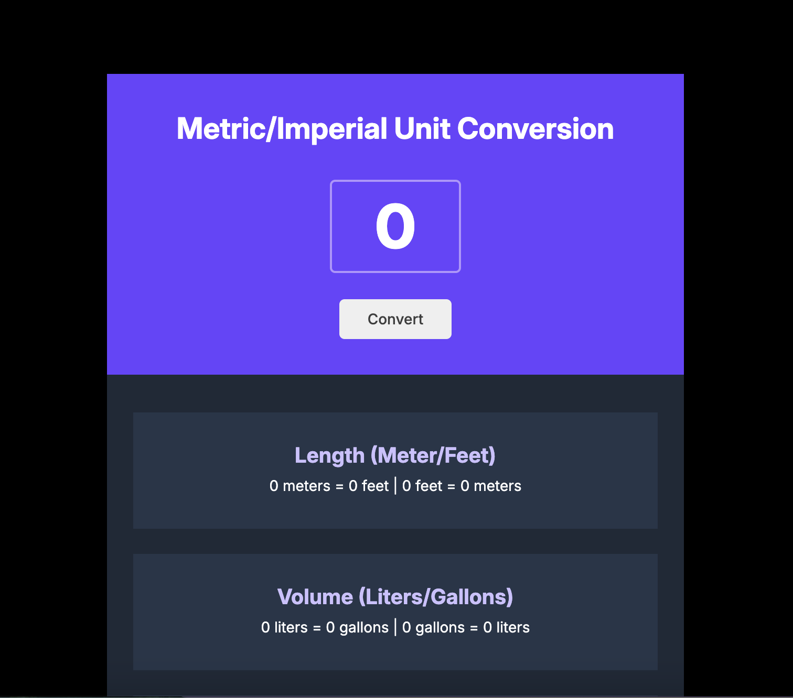

# Scrimba - Metric/Imperial Unit Conversion solution

Scrimba helps you improve your coding skills by building realistic projects.

## Table of contents

- [Overview](#overview)
  - [The challenge](#the-challenge)
  - [Screenshot](#screenshot)
  - [Links](#links)
- [My process](#my-process)
  - [Built with](#built-with)

## Overview

### The challenge

Users should be able to:

After entering a number (integer or decimal):
- pressing the “convert” button will calculate and display its equivalent in another measurement unit
- pressing “enter” will also calculate and display the result

### Screenshot

### Links

- Solution URL: [@GitHub](https://github.com/AnastasiiaHombalevska/unit-converter)
- Live Site URL: [@GitHub](https://brilliant-cajeta-6a28eb.netlify.app/)

## My process

### Built with

- Semantic HTML5 markup
- CSS custom properties
- CSS Flexbox Layout
- Mobile-first workflow
